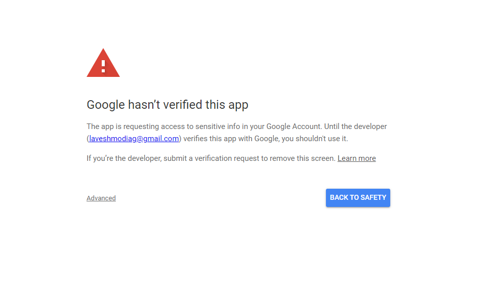

[](https://dl.circleci.com/status-badge/redirect/gh/your-username/your-repo/tree/develop)
[](https://codecov.io/gh/your-username/your-repo)

# Next.js 14 Full-Stack Application

|                                                                                                                |                                                                                                                       |                                                                                                                 |                                                                                                               |
| :------------------------------------------------------------------------------------------------------------: | :-------------------------------------------------------------------------------------------------------------------: | :-------------------------------------------------------------------------------------------------------------: | :-----------------------------------------------------------------------------------------------------------: |
|  |  |  |  |

This Next.js 14 project is bootstrapped with [`create-next-app`](https://github.com/vercel/next.js/tree/canary/packages/create-next-app) and uses the app router.

## Features

1. Server-side rendering and static site generation
2. API routes
3. Dynamic routing
4. Optimized loading with custom fonts
5. Easy deployment with Vercel

## Main tools

- Next.js
- Node.js
- MongoDB
- Vercel

## Requirements

- Node 16.x or higher
- npm, yarn, pnpm, or bun

You'll need to copy the contents of `.env.example` to a `.env` file and update with the necessary information.

## Getting Started

First, run the development server:

```bash
npm run dev
# or
yarn dev
# or
pnpm dev
# or
bun dev
```

Open [http://localhost:3000](http://localhost:3000) in your browser to see the result.

You can start editing the page by modifying `app/page.js`. The page auto-updates as you edit the file.

## Google Drive Credentials and File Access

To access Google Drive files, follow these steps to get the necessary credentials:

1. Visit [Google Cloud Console](https://console.cloud.google.com/).
   
2. Go to the dashboard and create a new project.
3. Select your new project.
4. Navigate to the API Library.
5. Search for "Google Drive API" and enable it.
6. Go to the OAuth consent screen section and create a new consent screen.
   - Choose "External"
   - Enter the "App Name: NEW"
   - Support email: "YOUR EMAIL"
   - Developer contact information email: "Developer email"
   - Save and continue
7. Add the necessary scopes for the Google Drive API.
   - Save and continue, then go back to the dashboard.
8. Navigate to Credentials.
9. Choose "Create OAuth client ID".
   - Application type: "Web application"
   - Authorized redirect URIs: "https://developers.google.com/oauthplayground"
10. Save your Client ID and Client Secret.

11. Open [OAuth Playground](https://developers.google.com/oauthplayground) in a new tab.

    

    - Scroll down to "Drive API v3"
    - Select the scope "https://www.googleapis.com/auth/drive"
    - In the right-hand side settings, check "Use your own OAuth credentials"
    - Enter your Client ID and Client Secret
    - Authorize APIs
    - Sign in with your email and grant permissions

12. If you encounter an error about contacting the developer, go back to the Google Console and publish your app to make it public.

13. You will get an access token. Use this to create the environment variables:

```env
NEXT_PUBLIC_GOOGLE_REFRESH_TOKEN="access token"
NEXT_PUBLIC_GOOGLE_REDIRECT_URI="https://developers.google.com/oauthplayground"
NEXT_PUBLIC_GOOGLE_CLIENT_SECRET="client secret"
NEXT_PUBLIC_GOOGLE_CLIENT_ID="client id"
```



Click on "Advanced" and then "Proceed".

## Learn More

To learn more about Next.js, take a look at the following resources:

- [Next.js Documentation](https://nextjs.org/docs) - Learn about Next.js features and API.
- [Learn Next.js](https://nextjs.org/learn) - An interactive Next.js tutorial.

You can check out [the Next.js GitHub repository](https://github.com/vercel/next.js/) - Your feedback and contributions are welcome!

## Deploy on Vercel

The easiest way to deploy your Next.js app is to use the [Vercel Platform](https://vercel.com/new?utm_medium=default-template&filter=next.js&utm_source=create-next-app&utm_campaign=create-next-app-readme) from the creators of Next.js.

Check out the [Next.js deployment documentation](https://nextjs.org/docs/deployment) for more details.

## Local Installation

- Clone the repository and navigate to the project directory:

```bash
git clone -b develop https://github.com/your-username/your-repo.git
cd your-repo
npm install
```

- To start the server after installation, run:

```bash
npm run dev
```

## Unit tests

- You can run the command `npm run test` to execute the unit tests added to the features controllers.

## Contributing

Contributions are what make the open-source community such an amazing place to learn, inspire, and create. Any contributions you make are **greatly appreciated**.

1. Fork the Project
2. Create your Feature Branch (`git checkout -b feature/AmazingFeature`)
3. Commit your Changes (`git commit -m 'Add some AmazingFeature'`)
4. Push to the Branch (`git push origin feature/AmazingFeature`)
5. Open a Pull Request
